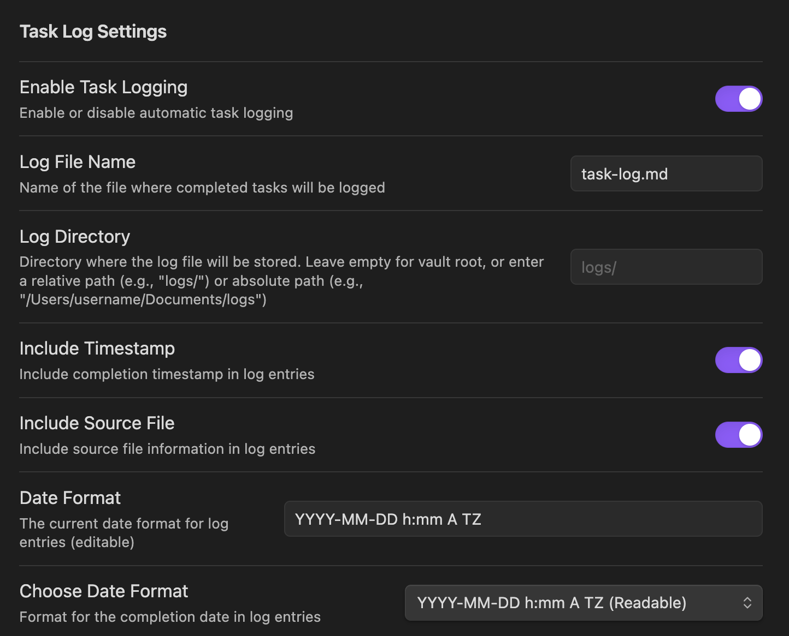

# Obsidian Task Log Plugin

A TypeScript-based Obsidian plugin that automatically logs completed tasks to a configurable file. The plugin monitors file changes and detects when tasks are marked as complete, then logs them with detailed information.



## Features

- **Automatic Task Detection**: Monitors markdown files for completed tasks (marked with `- [x]` or `- [X]`)
- **Configurable Logging**: Customize where and how completed tasks are logged
- **Rich Metadata**: Include timestamps and source file information
- **Flexible Storage**: Store logs inside or outside your Obsidian vault
- **Manual Logging**: Command to manually log completed tasks from the current file
- **No External Dependencies**: Works independently without requiring the Tasks plugin

## Installation

### Manual Installation

1. Download the latest release from the releases page
2. Extract the files to your Obsidian plugins folder: `<vault>/.obsidian/plugins/obsidian-task-log/`
3. Enable the plugin in Obsidian settings

### Development Installation

1. Clone this repository
2. Install dependencies: `npm install`
3. Build the plugin: `npm run build`
4. Copy the built files to your Obsidian plugins folder

## Configuration

The plugin provides several configuration options accessible through Obsidian's Settings panel:

### Basic Settings

- **Enable Task Logging**: Toggle the plugin on/off
- **Log File Name**: Name of the file where completed tasks will be logged (default: `task-log.md`)
- **Log Directory**: Directory where the log file will be stored. Leave empty for vault root, or enter a relative path (e.g., "logs/") or absolute path (e.g., "/Users/username/Documents/logs")

### Advanced Settings

- **Include Timestamp**: Add completion timestamp to log entries
- **Include Source File**: Include source file information in log entries

## Usage

### Automatic Logging

Once enabled, the plugin automatically detects when you mark a task as complete by changing `- [ ]` to `- [x]` in any markdown file. The completed task will be automatically logged to your configured log file.

### Manual Logging

Use the command palette (`Ctrl/Cmd + Shift + P`) and search for "Log completed tasks from current file" to manually log all completed tasks from the currently active file.

### Log File Format

Each completed task is logged with the following information:

```markdown
## [Timestamp]

**Source:** [[filename]]
**Line:** [line number]
- [x] [task text]

---
```

## Development

### Prerequisites

- Node.js 16+
- npm or yarn

### Setup

1. Clone the repository
2. Install dependencies: `npm install`
3. Start development mode: `npm run dev`
4. Run tests: `npm test`
5. Check test coverage: `npm run test:coverage`

### Project Structure

```
src/
├── main.ts              # Main plugin class
├── settings.ts          # Settings configuration
├── task-detector.ts     # Task detection logic
└── task-logger.ts       # Task logging functionality

tests/
├── __mocks__/           # Mock implementations
├── main.test.ts         # Main plugin tests
├── settings.test.ts     # Settings tests
├── task-detector.test.ts # Task detector tests
├── task-logger.test.ts  # Task logger tests
└── e2e/                 # End-to-end tests
    ├── global-setup.ts  # Test environment setup
    ├── global-teardown.ts # Test cleanup
    ├── obsidian-helper.ts # Obsidian testing utilities
    ├── task-logging.spec.ts # Core functionality tests
    ├── plugin-functionality.spec.ts # Plugin logic tests
    └── sandbox-vault/   # Test vault with sample data
```

### Testing

The plugin includes comprehensive testing with multiple approaches:

#### **Unit Tests (Jest)**
- **Fast feedback**: Test individual components in isolation
- **Mock Obsidian API**: Simulate Obsidian environment for testing
- **Coverage Reporting**: Detailed coverage reports for all source files

Run unit tests with:
```bash
npm test              # Run all tests
npm run test:watch    # Run tests in watch mode
npm run test:coverage # Run tests with coverage report
```

#### **End-to-End Tests (Playwright)**
- **Real functionality**: Test plugin logic in browser environment
- **Core logic validation**: Verify task detection and log formatting
- **Settings testing**: Test different configuration combinations

Run E2E tests with:
```bash
npm run test:e2e        # Run all E2E tests
npm run test:e2e:ui    # Interactive UI mode
npm run test:e2e:debug # Debug mode for troubleshooting
```

**Test Coverage**: Maintains at least 80% coverage across all test types

### Building

Build the plugin for production:

```bash
npm run build
```

This creates the `main.js` file that Obsidian loads.

## How It Works

1. **Event Monitoring**: The plugin listens to file change events in Obsidian
2. **Task Detection**: When a file changes, it scans for completed tasks using regex patterns
3. **Context Extraction**: Extracts surrounding context and metadata for each completed task
4. **Logging**: Formats and writes task information to the configured log file
5. **Error Handling**: Gracefully handles errors and provides user feedback

## Task Detection

The plugin detects completed tasks using the following patterns:
- `- [x] Task description` (lowercase x)
- `- [X] Task description` (uppercase X)

Tasks are considered complete when the checkbox is marked with either `x` or `X`.

## Log File Location

By default, the log file is created in your vault root directory. You can configure the location by entering a path in the Log Directory setting:

- **Empty**: Store in vault root (e.g., `task-log.md`)
- **Relative Path**: Store within your vault (e.g., `logs/task-log.md`)
- **Absolute Path**: Store outside your vault (e.g., `/Users/username/Documents/logs/task-log.md`)

The plugin automatically detects whether you've entered a relative or absolute path, so you don't need to specify which type you're using.

## Contributing

1. Fork the repository
2. Create a feature branch
3. Make your changes
4. Add tests for new functionality
5. Ensure all tests pass with coverage ≥80%
6. Submit a pull request

## License

MIT License - see LICENSE file for details.

## Support

If you encounter issues or have questions:

1. Check the existing issues on GitHub
2. Create a new issue with detailed information
3. Include your Obsidian version and plugin version
4. Provide steps to reproduce the issue

## Changelog

### v1.0.0
- Initial release
- Automatic task detection and logging
- Configurable settings
- Comprehensive test coverage
- TypeScript implementation
